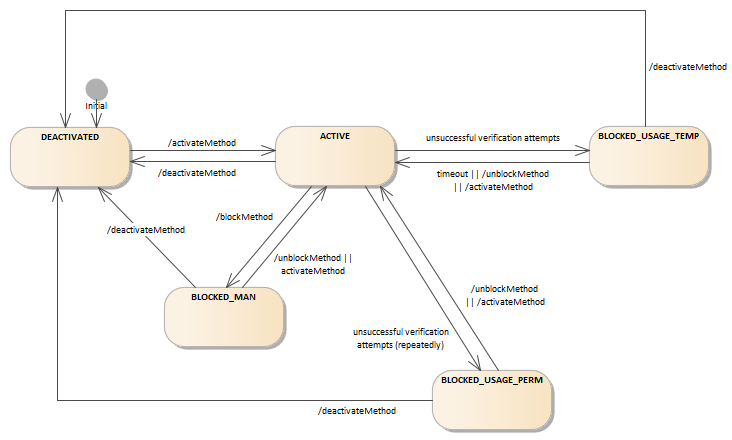
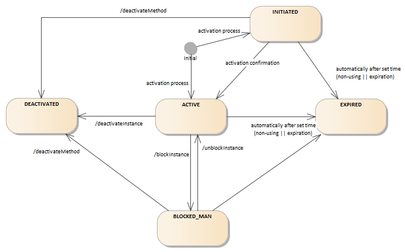

# Model

Every user is identified by his/her `muid`, that is supposed to be unique within the whole installation (not only within one `tenant`).

There are several methods available for user - PASSWORD, SMS, CM, ACTIVATION_CODE. User can operate a method only if there is an instance of a method activated.

* SMS, ACTIVATION_CODE - auto-activated single-instance methods, i.e. instance is activated with method activation and method can only have one instance
* PASSWORD - single-instance method, i.e. method can only have one instance, activate instance is deactivated if new one is activated
* CM - multi-instance method, i.e. there can be more active instances of a method

### Method and instance state

State of the method is prioritized over state of the instance. The change of the method state does not influence the state of its instance(s) and vice versa. The only exception is that with method activation all usable instances are deactivated. You must have both method and instance active to be able to perform transaction operations.

#### Method state diagram

#### Instance state diagram

### Blocking rules

Only the method can be blocked by unsuccessful transaction verification attempts. The instance can be blocked only manually.

Possible configuration settings:

* number of unsuccessful transaction verification attempts
* time of temporary method blocking
* number of repeated temporary blocking before permanent blocking
* wheter to cancel transaction after blocking
